[](https://github.com/edycutjong/aegis/actions/workflows/ci.yml)
[](https://github.com/edycutjong/aegis)
[](https://www.python.org/)
[](https://nextjs.org/)
[](https://opensource.org/licenses/MIT)

# ⛊ Aegis — Autonomous Enterprise Action Engine

> **Read the full Case Study & Architecture Breakdown here:** [edycu.dev/work/aegis](https://edycu.dev/work/aegis)

> A multi-agent AI system that acts as a Tier-2 Support Engineer. Investigates complex issues via SQL + documentation, proposes financial/technical actions, and **waits for human approval** before executing.

## 📸 Demo

<p align="center">
  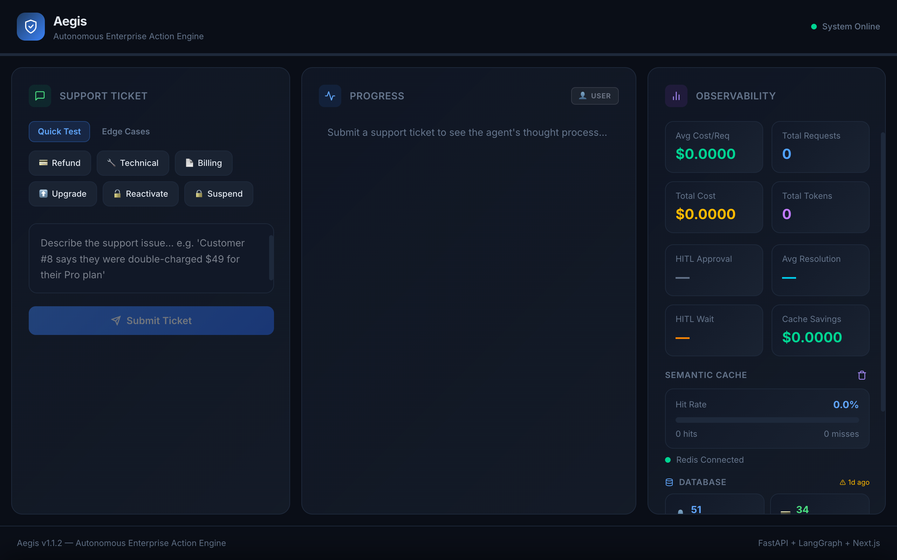
</p>

<details>
<summary>🧠 Agent ThoughtStream (Real-time Processing)</summary>
<br>
<p align="center">
  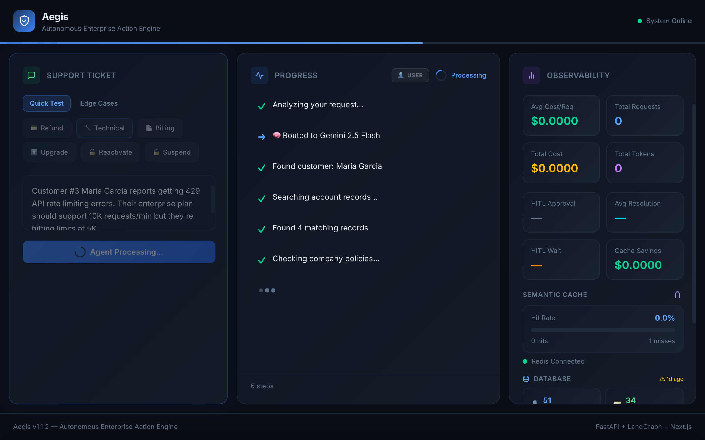
</p>
<p align="center"><em>Watch the agent think step-by-step: intent classification → customer validation → SQL generation → policy search → action proposal</em></p>
</details>

<details>
<summary>⚡ Full Resolution Workflow</summary>
<br>
<p align="center">
  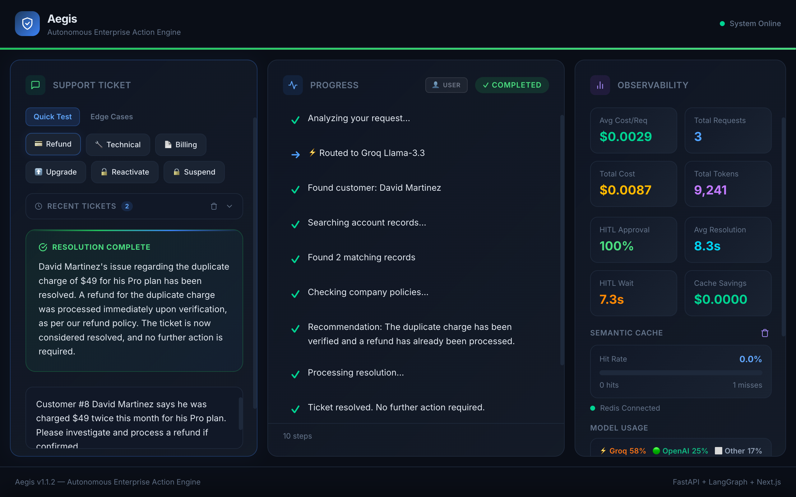
</p>
<p align="center">
  <em>Agent resolves a ticket end-to-end: intent classification → customer validation → SQL execution → policy search → human approval → resolution</em>
</p>
</details>

<details>
<summary>🔒 Human-in-the-Loop Approval Modal</summary>
<br>
<p align="center">
  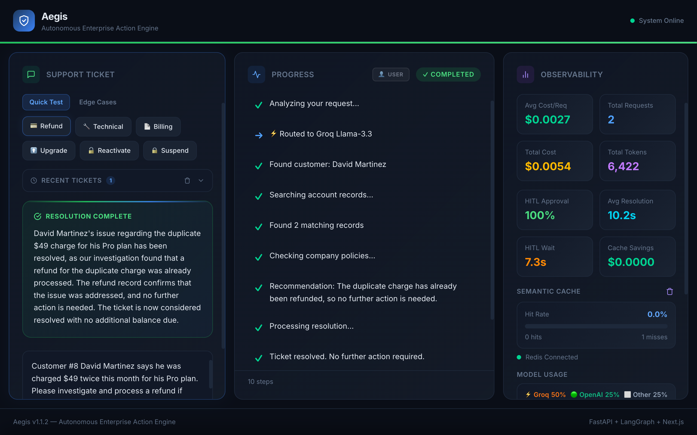
</p>
<p align="center"><em>The agent pauses and waits for human authorization before executing any action requiring strict oversight</em></p>
</details>

<details>
<summary>🔧 Multi-Ticket Type Support (Technical, Billing, Upgrade, Reactivate, Suspend)</summary>
<br>
<p align="center">
  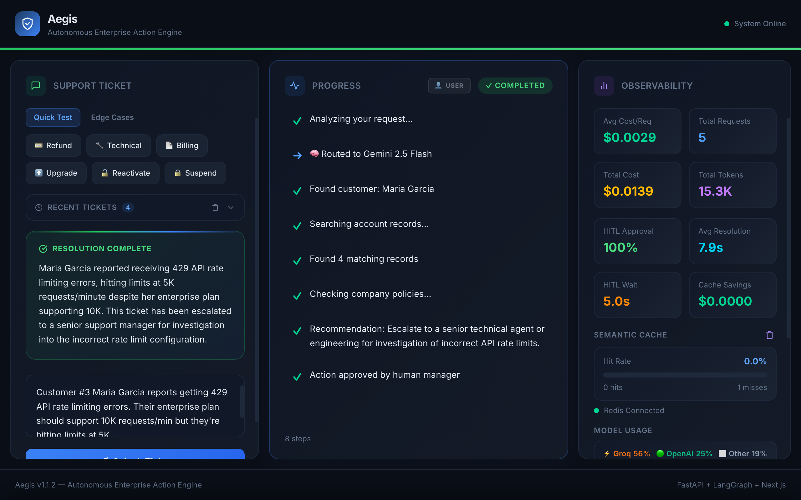
</p>
<p align="center"><em>Technical ticket: Investigates API rate limiting errors with SQL queries and resolves automatically (no HITL needed)</em></p>
<br>
<p align="center">
  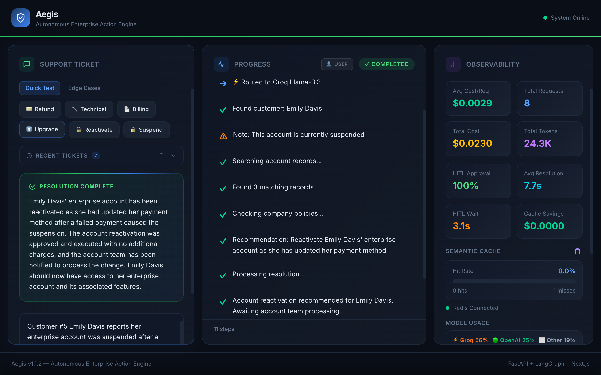
</p>
<p align="center"><em>Account reactivation: HITL approval required before restoring suspended enterprise accounts</em></p>
<br>
<p align="center">
  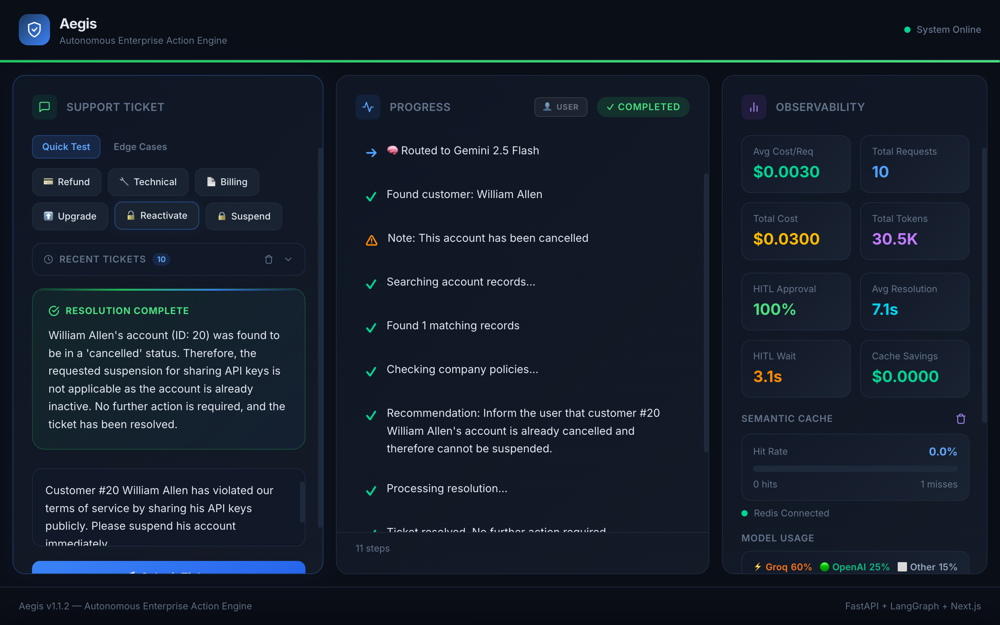
</p>
<p align="center"><em>Account suspension: HITL approval required before suspending accounts for ToS violations</em></p>
</details>

<details>
<summary>✍️ Smart Customer Validation (Edge Cases)</summary>
<br>
<p align="center">
  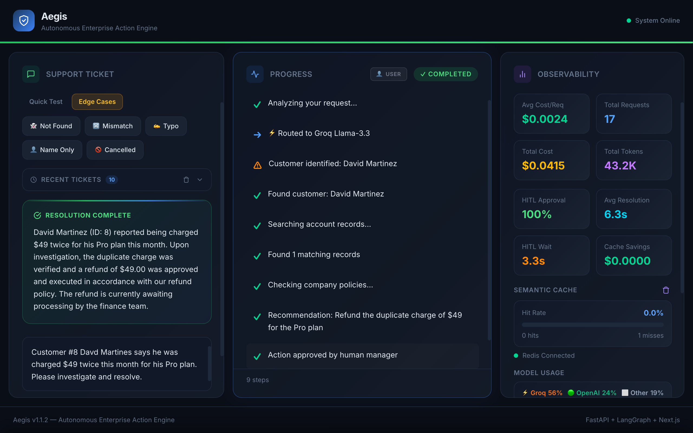
</p>
<p align="center"><em>Typo correction: "Davd Martines" fuzzy-matched to "David Martinez" (≥80% similarity)</em></p>
<br>
<p align="center">
  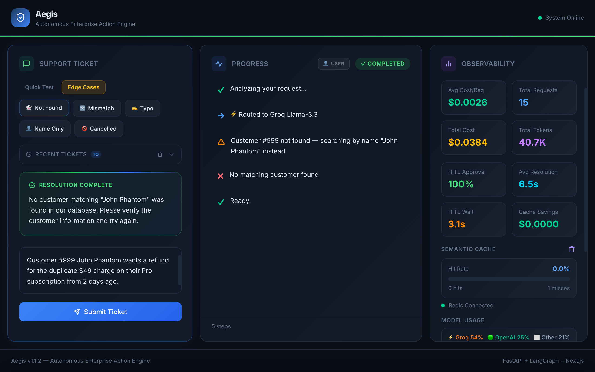
</p>
<p align="center"><em>Customer #999 not found — the agent stops gracefully with a clear error message</em></p>
<br>
<p align="center">
  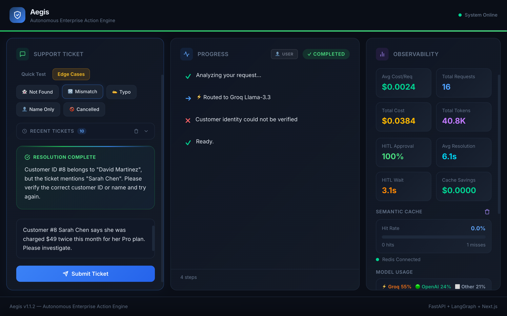
</p>
<p align="center"><em>Name/ID mismatch: Customer #8 is David Martinez, not Sarah Chen — agent flags the security mismatch</em></p>
</details>

<details>
<summary>⚡ Semantic Cache</summary>
<br>
<p align="center">
  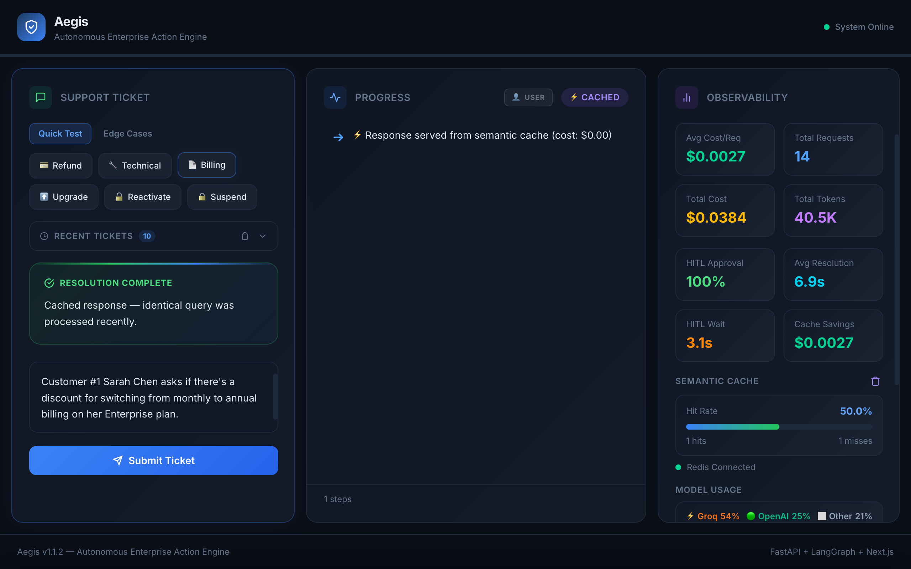
</p>
<p align="center"><em>Identical query served from Redis cache in &lt;50ms at $0.00 cost</em></p>
</details>

<details>
<summary>📊 Observability Metrics</summary>
<br>
<p align="center">
  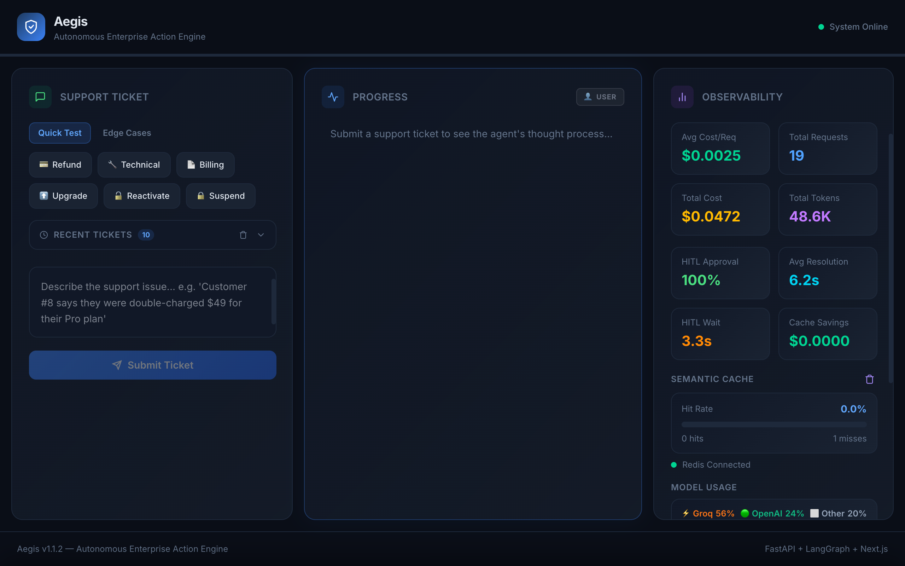
</p>
<p align="center"><em>Real-time observability: total tokens, cost per request, cache hit ratio, model distribution, HITL wait times</em></p>
</details>

<details>
<summary>🔭 LangSmith Traces</summary>
<br>
<p align="center">
  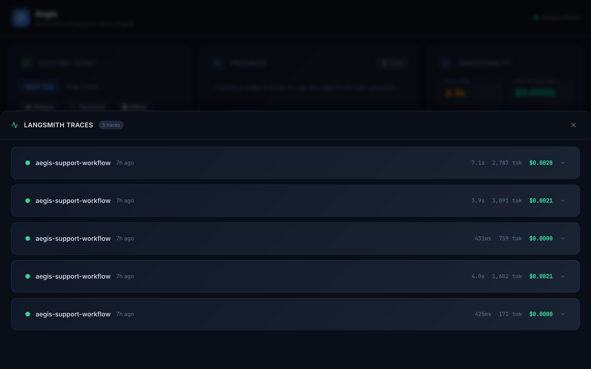
</p>
<p align="center"><em>Built-in LangSmith traces panel with run details, latency, token counts, and status per trace</em></p>
</details>

<details>
<summary>🗄️ Database Explorer & Ticket History</summary>
<br>
<p align="center">
  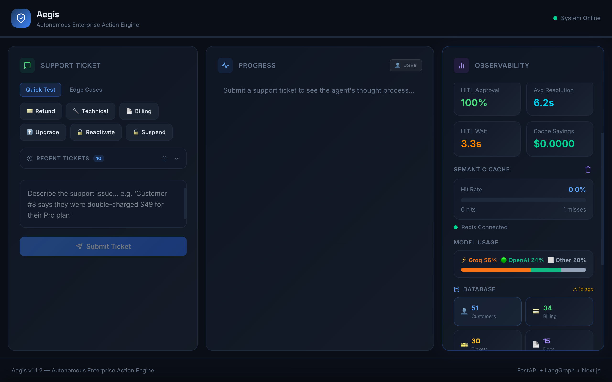
</p>
<p align="center"><em>Database explorer: browse Supabase tables (customers, billing, tickets, docs) directly from the dashboard</em></p>
<br>
<p align="center">
  
</p>
<p align="center"><em>Ticket history: all processed tickets persisted in localStorage with status and response preview</em></p>
</details>

## ✨ Key Features

| Feature | Description |
|---|---|
| **Human-in-the-Loop (HITL)** | Agent pauses execution and waits for human approval before taking destructive actions (refunds, suspensions). Non-destructive actions are auto-approved. |
| **Dynamic Model Routing** | Routes simple intents to Groq Llama-3 (~$0.00003), complex intents to GPT-4.1/Gemini (~$0.008) — with automatic fallback |
| **Smart Customer Validation** | Handles 8 edge cases: ID+name match, fuzzy name matching, typo correction, name-only search, disambiguation, suspended/cancelled accounts, not-found, and ID mismatch |
| **Self-Healing SQL** | Generates SQL from natural language, executes against Supabase, and auto-retries up to 3× by feeding errors back to the LLM |
| **Semantic Caching** | Identical queries served from Redis cache in <50ms at $0.00 cost — failures are never cached |
| **Real-time Streaming** | Watch the agent's thought process step-by-step via Server-Sent Events (SSE) |
| **Dual-Mode ThoughtStream** | Toggle between clean User mode and detailed Dev mode with color-coded agent badges |
| **Observability Dashboard** | Track token usage, cost per request, cache hit ratio, model distribution, and database status |

## 🏗️ Architecture

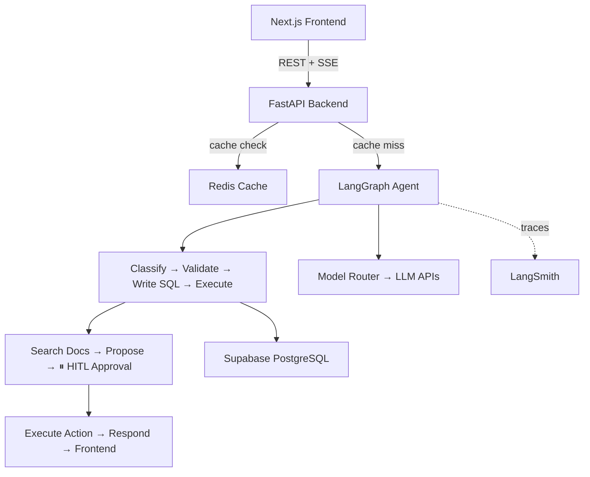

## 📁 Project Structure

```
aegis/
├── backend/
│   ├── app/
│   │   ├── agent/
│   │   │   ├── agents/          # 4 specialized agents
│   │   │   │   ├── classifier.py    # Triage Agent — intent classification
│   │   │   │   ├── investigator.py  # Investigator — customer validation + SQL
│   │   │   │   ├── researcher.py    # Knowledge Agent — doc search
│   │   │   │   └── resolver.py      # Resolution Agent — actions + HITL
│   │   │   ├── graph.py         # LangGraph workflow definition
│   │   │   ├── state.py         # AgentState TypedDict
│   │   │   └── nodes.py         # Re-export shim for backward compat
│   │   ├── cache/semantic.py    # Redis semantic caching
│   │   ├── db/supabase.py       # Async Supabase client
│   │   ├── routing/model_router.py  # Dynamic LLM routing + pricing
│   │   ├── observability/tracker.py # Token/cost tracking
│   │   ├── config.py            # Pydantic Settings
│   │   └── main.py              # FastAPI app + SSE endpoints
│   ├── tests/                   # 8 test files, 100% coverage
│   ├── Dockerfile
│   └── requirements.txt
├── frontend/
│   ├── src/
│   │   ├── app/page.tsx         # Main dashboard
│   │   ├── components/          # 6 React components
│   │   │   ├── AnimatedNumber.tsx    # Smooth animated value counter
│   │   │   ├── ApprovalModal.tsx     # HITL approval UI
│   │   │   ├── DatabaseStatus.tsx    # DB table explorer
│   │   │   ├── MetricsPanel.tsx      # Observability dashboard
│   │   │   ├── ThoughtStream.tsx     # Agent progress + Dev/User toggle
│   │   │   └── TicketHistory.tsx     # Recent tickets (localStorage)
│   │   ├── hooks/useTicketHistory.ts
│   │   └── lib/api.ts           # API client + SSE
│   ├── src/components/__tests__/ # 8 test files (Vitest + RTL)
│   ├── src/app/__tests__/       # 1 test file (Vitest + RTL)
│   ├── Dockerfile               # Multi-stage standalone build
│   └── package.json
├── docker-compose.yml           # Backend + Frontend + Redis
├── seed.sql                     # Sample data for Supabase
└── .github/workflows/ci.yml    # Ruff + pytest + ESLint + Docker build
```

## 🚀 Quick Start

### Prerequisites

- Python 3.12+
- Node.js 22+
- Docker & Docker Compose (for Redis)
- **API keys (minimum 2):**
  - [Groq](https://console.groq.com/keys) — free tier, handles fast tasks (classification, docs, response)
  - [OpenAI](https://platform.openai.com/api-keys) **or** [Anthropic](https://console.anthropic.com/settings/keys) — one is enough for complex tasks (SQL, action proposal)
  - [Google AI / Gemini](https://aistudio.google.com/apikey) — optional fallback

### 1. Clone & Setup

```bash
git clone https://github.com/edycutjong/aegis.git
cd aegis
```

### 2. Start with Docker Compose

```bash
docker-compose up
```

This starts the backend (port 8000), frontend (port 3000), and Redis.

### 3. Or run manually

> **Important:** Start Redis **before** the backend to avoid connection race conditions.

```bash
# Terminal 1: Redis (must be running before backend starts)
docker run -d -p 6379:6379 redis:alpine redis-server --requirepass aegis-dev

# Terminal 2: Backend
cd backend
python -m venv venv && source venv/bin/activate
pip install -r requirements.txt
cp .env.example .env  # Fill in your API keys
uvicorn app.main:app --reload --port 8000

# Terminal 3: Frontend
cd frontend
npm install
npm run dev
```

> **Note:** Set `REDIS_URL=redis://:aegis-dev@localhost:6379` in `backend/.env`.

### 4. Seed the database

Run `seed.sql` in the [Supabase SQL Editor](https://supabase.com/dashboard/project/_/sql) to populate sample customers, billing records, support tickets, and internal docs.

### 5. Open the dashboard

Visit `http://localhost:3000` and submit a support ticket.

## 🤖 Multi-Agent Architecture

Aegis organizes its workflow as **4 specialized agents** collaborating in sequence. Each agent has a clear responsibility and reports its progress via the real-time thought stream:

| Agent | Role | Nodes |
|---|---|---|
| 🏷 **Triage Agent** | Classifies incoming tickets into billing, technical, account, or general | `classify_intent` |
| 🔍 **Investigator Agent** | Validates customer identity (8 edge cases), generates & executes SQL with self-healing retry | `validate_customer`, `write_sql`, `execute_sql` |
| 📚 **Knowledge Agent** | Searches internal docs for relevant policies, procedures, and guidelines | `search_docs` |
| ⚡ **Resolution Agent** | Proposes actions, manages HITL approval, executes approved actions, generates summary | `propose_action`, `await_approval`, `execute_action`, `generate_response` |

### Agent Execution Trace

```
[Triage] Classified intent: billing (95%)
  → [Investigator] Customer validated: #8 David Martinez (pro, active)
  → [Investigator] SQL executed successfully — found 3 records
  → [Knowledge] Found 2 relevant internal documents
  → [Resolution] Proposed action: refund — Refund $29.99 duplicate charge
  → [Resolution] ⏸ Awaiting human approval...
  → [Resolution] Action executed: Refund processed (TXN-04821)
  → [Resolution] Generated resolution summary
```

### Customer Validation Edge Cases

The Investigator Agent handles these scenarios robustly:

| Scenario | Behavior |
|---|---|
| `Customer #8 David Martinez` | ✅ Direct ID+name match |
| `Customer #8 Davd Martines` | ✅ Fuzzy match (typo auto-corrected, ≥80% similarity) |
| `Emily Davis` (no ID) | ✅ Name search → exact match found |
| `Customer #8 Sarah Chen` (wrong name) | ⚠️ Name mismatch → stops with error |
| `Customer #999` | ⚠️ Not found → stops with error |
| `Customer #5` (suspended) | ⚠️ Proceeds with suspension warning |
| `Customer #20` (cancelled) | ⚠️ Proceeds with cancellation warning |
| `Smith` (ambiguous name) | 🔀 Multiple matches → returns candidates for disambiguation |

## 📊 Cost Analysis

| Model | Used For | Cost per Request |
|---|---|---|
| Llama-3.1-8B (Groq) | Intent classification, search, response | ~$0.00003 |
| Gemini 2.5 Flash | Fallback fast tasks | ~$0.0001 |
| GPT-4.1 / Claude | SQL generation + reasoning | ~$0.008 |
| **Total avg per ticket** | | **~$0.009** |
| **With semantic cache hit** | | **$0.00** |

### Model Routing Strategy

```
Simple intents (billing_inquiry, general)  →  Groq Llama-3.3-70B  (fast, free)
Complex intents (refund, account, technical)  →  Gemini 2.5 Flash  (accurate)
SQL generation + action proposal  →  GPT-4.1 / Claude  (smart)

Groq unavailable?  →  Automatic fallback to Gemini
```

## 🛠 Tech Stack

| Layer | Technology |
|---|---|
| **Backend** | Python 3.12+, FastAPI, LangGraph, LangChain |
| **Frontend** | Next.js 16, React 19, TypeScript, Tailwind CSS 4 |
| **Database** | Supabase (PostgreSQL) |
| **Cache** | Redis (semantic deduplication) |
| **LLMs** | Groq/Llama-3 (fast), GPT-4.1/Claude (complex), Gemini (fallback) |
| **Observability** | LangSmith tracing + built-in token/cost tracking |
| **Testing** | pytest + pytest-cov (backend), Vitest + React Testing Library (frontend) |
| **CI/CD** | GitHub Actions — lint, test, coverage, Docker build |

## 🔭 Observability

Every LangGraph run produces a full trace in [LangSmith](https://smith.langchain.com/) showing the complete pipeline with token counts and latency per step:

```
classify_intent → validate_customer → write_sql → execute_sql
  → search_docs → propose_action → await_approval → execute_action → generate_response
```

### Setup

1. Create a free account at [smith.langchain.com](https://smith.langchain.com/)
2. Get your API key from **Settings → API Keys**
3. Add to your `backend/.env`:

```bash
LANGCHAIN_TRACING_V2=true
LANGCHAIN_API_KEY=lsv2_pt_...
LANGCHAIN_PROJECT=aegis
```

4. Verify connectivity:

```bash
curl http://localhost:8000/api/tracing-status
# → {"enabled": true, "project": "aegis", "connected": true}
```

### What's Traced

- **Node-level spans** via `@traceable` decorators on all agent nodes
- **LLM calls** auto-traced by LangChain (input/output, token counts, model name)
- **Graph execution** with `run_name="aegis-support-workflow"` for easy filtering

## 🧪 Testing

**100% coverage** across both backend and frontend — fully offline, no API keys or network needed.

### Backend (pytest)

```bash
cd backend

# Run all tests
python -m pytest tests/ -v

# With coverage report
python -m pytest tests/ --cov=app --cov-report=term-missing

# CI enforces 100%
python -m pytest tests/ --cov=app --cov-fail-under=100
```

| Module | Stmts | Cover |
|---|---|---|
| `classifier.py` (Triage Agent) | 29 | 100% |
| `investigator.py` (Investigator Agent) | 138 | 100% |
| `researcher.py` (Knowledge Agent) | 14 | 100% |
| `resolver.py` (Resolution Agent) | 150 | 100% |
| `main.py` (API + SSE + HITL) | 270 | 100% |
| `model_router.py` | 43 | 100% |
| `semantic.py` (cache) | 73 | 100% |
| `tracker.py` (observability) | 71 | 100% |
| `supabase.py` | 45 | 100% |
| All other modules | 123 | 100% |
| **Total** | **956** | **100%** |

### Frontend (Vitest + React Testing Library)

```bash
cd frontend

# Run all tests
npm run test

# With coverage
npx vitest run --coverage
```

| Test Suite | Tests |
|---|---|
| `page.test.tsx` | Dashboard rendering, submission, preset buttons |
| `ApprovalModal.test.tsx` | HITL approve/deny flow, animations |
| `AnimatedNumber.test.tsx` | Number formatting, animations, cleanup requests |
| `MetricsPanel.test.tsx` | Metrics display, cache clear, DB explorer |
| `ThoughtStream.test.tsx` | Dev/User mode toggle, message simplification, idle empty states |
| `TicketHistory.test.tsx` | History persistence, clear, selection |
| `useTicketHistory.test.ts` | Hook behavior, localStorage |
| `api.test.ts` | API client, SSE connection, error handling |

## ⚙️ Environment Variables

Copy `backend/.env.example` to `backend/.env` and configure:

| Variable | Required | Description |
|---|---|---|
| `SUPABASE_URL` | ✅ | Supabase project URL |
| `SUPABASE_KEY` | ✅ | Supabase anon/public key |
| `GROQ_API_KEY` | ✅ | Groq API key (free — handles fast tasks) |
| `OPENAI_API_KEY` | ⚡ | OpenAI key (need at least one "smart" provider) |
| `ANTHROPIC_API_KEY` | ⚡ | Anthropic key (alternative to OpenAI) |
| `GOOGLE_API_KEY` | ➖ | Google Gemini key (optional fallback) |
| `FAST_MODEL` | ➖ | Fast model name (default: `llama-3.1-8b-instant`) |
| `SMART_MODEL` | ➖ | Smart model name (default: `gpt-4.1`) |
| `REDIS_URL` | ➖ | Redis connection URL (default: `redis://localhost:6379`) |
| `CACHE_TTL_SECONDS` | ➖ | Cache TTL in seconds (default: `3600`) |
| `FRONTEND_URL` | ➖ | CORS origin (default: `http://localhost:3000`) |
| `LANGCHAIN_API_KEY` | ➖ | LangSmith API key for tracing |
| `DEBUG` | ➖ | Enable debug logging (default: `false`) |

> ✅ = required, ⚡ = need at least one, ➖ = optional

## 📄 License

MIT
