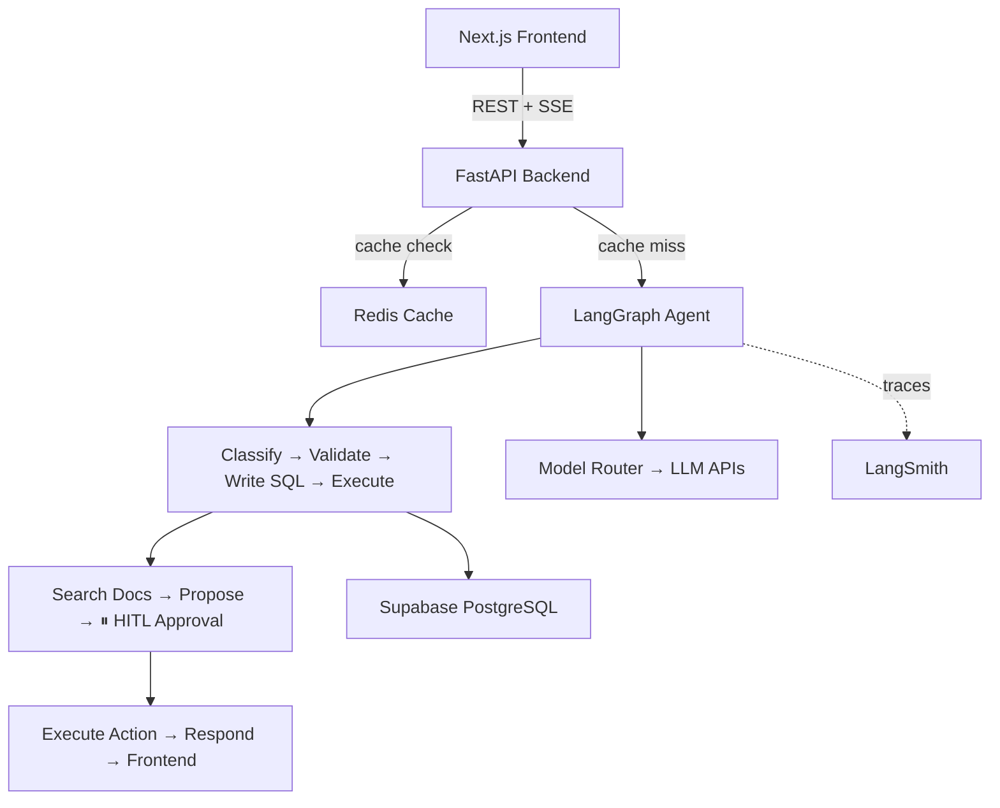

[](https://github.com/edycutjong/aegis/actions/workflows/ci.yml)
[](https://github.com/edycutjong/aegis)

# ⛊ Aegis — Autonomous Enterprise Action Engine

> A multi-agent AI system that acts as a Tier-2 Support Engineer. Investigates complex issues via SQL + documentation, proposes financial/technical actions, and **waits for human approval** before executing.


## ✨ Key Features

| Feature | Description |
|---|---|
| **Human-in-the-Loop (HITL)** | Agent pauses execution and waits for human approval before taking destructive actions |
| **Dynamic Model Routing** | Routes simple tasks to fast/cheap models, complex tasks to powerful models — optimizing cost |
| **Semantic Caching** | Identical queries served from Redis cache in <50ms. Cost: $0.00 |
| **Real-time Streaming** | Watch the agent's thought process step-by-step via Server-Sent Events |
| **Observability Dashboard** | Track token usage, cost per request, cache hit ratio, and model distribution |

## 🏗️ Architecture



## 🚀 Quick Start

### Prerequisites

- Python 3.11+
- Node.js 22+
- Docker & Docker Compose (for Redis)
- **API keys (minimum 2):**
  - [Groq](https://console.groq.com/keys) — free tier, handles fast tasks (classification, docs, response)
  - [OpenAI](https://platform.openai.com/api-keys) **or** [Anthropic](https://console.anthropic.com/settings/keys) — one is enough for complex tasks (SQL, action proposal)
  - [Google AI / Gemini](https://aistudio.google.com/apikey) — optional fallback

### 1. Clone & Setup

```bash
git clone https://github.com/edycutjong/aegis.git
cd aegis
```

### 2. Start with Docker Compose

```bash
docker-compose up
```

This starts the backend (port 8000), frontend (port 3000), and Redis.

### 3. Or run manually

```bash
# Terminal 1: Backend
cd backend
python -m venv venv && source venv/bin/activate
pip install -r requirements.txt
cp .env.example .env  # Fill in your API keys
uvicorn app.main:app --reload --port 8000

# Terminal 2: Frontend
cd frontend
npm install
cp .env.example .env.local
npm run dev

# Terminal 3: Redis
docker run -d -p 6379:6379 redis:7-alpine
```

### 4. Open the dashboard

Visit `http://localhost:3000` and submit a support ticket.

## 📊 Cost Analysis

| Model | Used For | Cost per Request |
|---|---|---|
| Llama-3.1-8B (Groq) | Intent classification, search, response | ~$0.00003 |
| Gemini 2.5 Flash | Fallback fast tasks | ~$0.0001 |
| GPT-4.1 / Claude | SQL generation + reasoning | ~$0.008 |
| **Total avg per ticket** | | **~$0.009** |
| **With semantic cache hit** | | **$0.00** |

## 🛠 Tech Stack

- **Backend:** Python, FastAPI, LangGraph, LangChain
- **Frontend:** Next.js 16, React, Tailwind CSS
- **Database:** Supabase (PostgreSQL)
- **Cache:** Redis
- **LLMs:** Groq/Llama-3 (fast), GPT-4.1/Claude (complex), Gemini (fallback)
- **Observability:** LangSmith tracing + built-in token/cost tracking

## 🔭 Observability

Every LangGraph run produces a full trace in [LangSmith](https://smith.langchain.com/) showing the complete pipeline with token counts and latency per step:

```
classify_intent → validate_customer → write_sql → execute_sql
  → search_docs → propose_action → await_approval → execute_action → generate_response
```

### Setup

1. Create a free account at [smith.langchain.com](https://smith.langchain.com/)
2. Get your API key from **Settings → API Keys**
3. Add to your `backend/.env`:

```bash
LANGCHAIN_TRACING_V2=true
LANGCHAIN_API_KEY=lsv2_pt_...
LANGCHAIN_PROJECT=aegis
```

4. Verify connectivity:

```bash
curl http://localhost:8000/api/tracing-status
# → {"enabled": true, "project": "aegis", "connected": true}
```

### What's Traced

- **Node-level spans** via `@traceable` decorators on all agent nodes
- **LLM calls** auto-traced by LangChain (input/output, token counts, model name)
- **Graph execution** with `run_name="aegis-support-workflow"` for easy filtering

## 🧪 Testing

**188 tests · 100% coverage · fully offline** — no API keys, Redis, or network needed.

```bash
cd backend

# Run all tests
python -m pytest tests/ -v

# With coverage report
python -m pytest tests/ --cov=app --cov-report=term-missing

# Run a specific file
python -m pytest tests/test_agent_nodes.py -v
```

| Module | Stmts | Cover |
|---|---|---|
| `nodes.py` (agent workflow) | 257 | 100% |
| `main.py` (API + SSE + HITL) | 170 | 100% |
| `model_router.py` | 32 | 100% |
| `semantic.py` (cache) | 58 | 100% |
| `tracker.py` (observability) | 62 | 100% |
| `supabase.py` | 45 | 100% |
| All other modules | 107 | 100% |
| **Total** | **731** | **100%** |

## 📄 License

MIT
