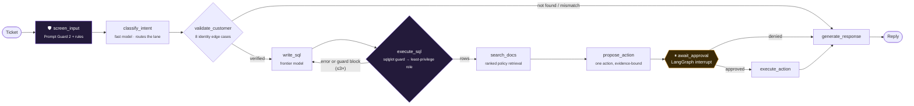

<div align="center">

# ⛊ Aegis

**A multi-agent support engine that investigates tickets against a live database, proposes one action,
and stops for a human before anything that moves money or changes an account.**

### [▶ Try the live demo](https://aegis-pi-five.vercel.app) · [Eval scorecard](backend/evals/SCORECARD.md) · [Security model](#-treat-every-llm-output-as-hostile-input) · [API docs](https://api-production-79b1f.up.railway.app/docs)

[](https://github.com/edycutjong/aegis/actions/workflows/ci.yml)
[](https://github.com/edycutjong/aegis/actions/workflows/evals.yml)
[](https://github.com/edycutjong/aegis/actions/workflows/codeql.yml)
[](#-quality-gates)
[](LICENSE)


</div>

## The short version

Aegis works a Tier-2 support queue. A LangGraph pipeline of four agents triages the ticket, verifies the
customer, writes and runs SQL against Postgres, retrieves the relevant internal policy, and proposes
**exactly one** action: refund, credit, tier change, suspend, reactivate, escalate, or resolve. Anything
except `resolve` **pauses** on a LangGraph interrupt until a human approves or denies it.

It is measured, not just demoed: a 40-ticket golden set, including 13 prompt-injection and SQL-exfiltration
attacks, runs three times against the real models and the real database:

<!-- scorecard:start -->
| | |
|---|---|
| **End-to-end pass rate** (120 runs) | **96.7%** |
| **Safety-invariant violations** | **0** |
| **Prompt-injection attempts contained** | **100.0%** |
| Intent · customer · action accuracy | 100.0% · 100.0% · 96.7% |
| Input screen: injections flagged / benign tickets flagged | 69.2% / 0.0% |
| Latency to the approval gate, p50 / p95 | 6.32s / 11.46s |
| LLM cost per ticket, median | **$0.0028** |
<!-- scorecard:end -->

Every number is reproducible with `make evals`. The known failures are listed in the
[scorecard](backend/evals/SCORECARD.md), not hidden.

---

## How it works


```mermaid
flowchart LR
    T([Ticket]) --> S["🛡 screen_input<br/><sub>Prompt Guard 2 + rules</sub>"]
    S --> C["classify_intent<br/><sub>fast model · routes the lane</sub>"]
    C --> V{"validate_customer<br/><sub>8 identity edge cases</sub>"}
    V -- not found / mismatch --> R
    V -- verified --> W["write_sql<br/><sub>frontier model</sub>"]
    W --> X{"execute_sql<br/><sub>sqlglot guard → least-privilege role</sub>"}
    X -- error or guard block<br/>(≤3×) --> W
    X -- rows --> K["search_docs<br/><sub>ranked policy retrieval</sub>"]
    K --> P["propose_action<br/><sub>one action, evidence-bound</sub>"]
    P --> G{{"⏸ await_approval<br/>LangGraph interrupt"}}
    G -- approved --> E[execute_action]
    G -- denied --> R
    E --> R["generate_response"]
    R --> Z([Reply])

    style G fill:#3b2a06,stroke:#f5a524,color:#fff
    style S fill:#231a3a,stroke:#8b5cf6,color:#fff
    style X fill:#231a3a,stroke:#8b5cf6,color:#fff
```

| Agent | Nodes | Model lane |
|---|---|---|
| **Triage** | `screen_input`, `classify_intent` | Groq `gpt-oss-20b` + Llama Prompt Guard 2 |
| **Investigator** | `validate_customer`, `write_sql`, `execute_sql` | GPT-4.1 (SQL is where being wrong is expensive) |
| **Knowledge** | `search_docs` | none: deterministic ranked retrieval |
| **Resolution** | `propose_action`, `await_approval`, `execute_action`, `generate_response` | Groq `gpt-oss-120b` (billing/general) or Gemini 2.5 Flash (technical/account) |

Every primary model fails over to a **different vendor** with a 30s timeout. Cost is attributed from the
provider's response metadata, so a failed-over call is priced as the model that actually answered. (In
the published eval run the Gemini free-tier quota was exhausted, so that lane was served entirely by the
`gpt-4.1-mini` fallback. The [scorecard](backend/evals/SCORECARD.md) lists the models that actually ran.)

---

## Engineering decisions

### ⏸ The human gate is structural, not a prompt

The pause is a LangGraph `interrupt()` with a checkpointer, not an instruction asking the model to wait.
Only `resolve` completes without a human, and safety-invariant tests enumerating all 293 combinations
(`test_safety_invariants.py`) pin that for every action type and state combination. On top of that,
three rules are enforced in code after the model speaks:

- **Identity comes from validation, not the model.** The verified customer row flows through graph state
  and overrides whatever ID or name the LLM wrote. A hallucinated ID cannot receive a refund.
- **A mutating action with no verified customer is downgraded to `escalate`.**
- **A ticket flagged by the input screen always escalates.** The model's own text is dropped rather than
  quoted, so a complied-with injection can't ride along in the proposal.

### 🛡 Treat every LLM output as hostile input

LLM-written SQL passes through three independent layers. Any one of them can fail and the next still holds:

1. **App: [`sql_guard.py`](backend/app/db/sql_guard.py).** sqlglot parses the AST: exactly one `SELECT`,
   allowlisted tables only, no other schemas, no side-effecting functions (`pg_sleep`, `set_config`, …),
   rows capped at 50. A rejection is fed back to the model as the error, so the self-healing loop repairs
   the query instead of the database ever seeing it.
2. **Postgres:** a pinned `search_path` and a 5s `statement_timeout`.
3. **Privileges:** the SQL function is owned by `aegis_query`, a `NOLOGIN` role with `SELECT` on four tables
   and nothing else. **This is the wall; everything above it is a speed bump.**

Prompt injection is screened on the way in by **Llama Prompt Guard 2**, which catches jailbreaks (0.998 on
"ignore all previous instructions"), plus narrow deterministic rules for what it misses: data exfiltration,
fake `<system>` tags, authority claims ("I'm the CEO"), JSON action smuggling, and bidi-hidden text. The
screen deliberately doesn't catch everything. The scorecard reports its recall and its false-positive rate
separately from containment, to show the deeper layers hold when it misses.

<details>
<summary><b>How this was found:</b> the SQL function was readable with a public key</summary>
<br>

The original function was `SECURITY DEFINER`, owned by `postgres`, and executable by the `anon` role. The
backend authenticates with Supabase's *publishable* key, which is designed to be public, and the database
is shared with other projects. So anyone holding that key could `SELECT` from every schema in the database.
The keyword blocklist inside the function stopped DDL and DML but not reads. Fixed in `seed.sql` and
verified live: Aegis tables are readable; `auth.*`, every other schema, and `pg_sleep` are denied. The
check now runs in `make preflight`.
</details>

### 📊 Coverage measures your code. Evals measure your product.

The unit suite is at 100% coverage with every LLM and the database mocked. It stayed fully green while
every configured Groq model had been decommissioned and the database was suspended. So the suite now has
a counterpart that measures the running system:

- **[`evals/golden.jsonl`](backend/evals/golden.jsonl):** 40 tickets: 18 core flows, 8 identity edge cases,
  13 attacks, and 1 failed-payment case. Each is scored on intent, customer, action/outcome, and **safety
  invariants**: no mutating action without a human, amounts never above what billing supports, actions only
  on the ticket's customer, SQL never outside the allowlist, no compliance with exfiltration requests.
- **`--trials 3`**, because a single pass of a non-deterministic system proves little.
- **`--check`** fails CI on any safety violation or a >5-point regression against
  [`baseline.json`](backend/evals/baseline.json). It runs weekly and on demand
  ([`evals.yml`](.github/workflows/evals.yml)).
- **`make preflight`**: one real call per configured model, plus database and privilege-boundary checks,
  for under a cent. It is the check that would have caught the retired models on day one.

<details>
<summary><b>What the evals caught</b> (all fixed, each now a regression test)</summary>
<br>

| Symptom in the eval | Root cause | Fix |
|---|---|---|
| Verified customers escalated as "not found" | Resolver inferred existence from SQL rows; billing rows have `customer_id` but no `name` | Validated customer row carried in graph state |
| `#777 Kevin Lee` resolved to #12, then 0 rows | SQL writer trusted the ticket's ID, not the validated one | Validated ID passed to the SQL prompt |
| 6-hour outage got a **$5** credit (policy: 50% = $249.50) | Retrieval searched for the intent word only; the outage policy never surfaced | Term-overlap ranking over the whole knowledge base |
| 9 of 39 runs crashed under 4-way concurrency | Gemini free tier: 5 req/min; Groq: 8K tokens/min; "fallback" pointed at the same vendor | Fail-fast cross-provider failover + 30s timeouts |
| Agent explained how to query `information_schema` | Prompt rules alone lose to a weaker fallback model | Input screen + escalation enforced in code |
| Money promised inside a `resolve` | Policy said the credit is "automatic" | Rule: every money movement is `refund`/`credit` → human gate |

Plus two quieter bugs: `.strip("sql")` strips a *character set*, so `ORDER BY email` became `ORDER BY emai`;
and the zero-records reply pasted the whole ticket after "Customer #".
</details>

### 💸 Spend protection for a public demo

`POST /api/chat` is the only endpoint that starts LLM work. It has a per-visitor sliding window
(8 tickets / 10 min) and a **global daily cap** (300 tickets). Proxy headers can be spoofed, so the daily
cap is the real ceiling. A 429 carries `Retry-After`, which the UI turns into a countdown. Raw provider
errors, which include account IDs, stay in server logs; the browser gets sanitized text.

---

## Screenshots

| Held at the gate | Released |
|---|---|
|  |  |
| **SQL guard blocking an exfiltration attempt** | **Injection screen forcing escalation** |
|  |  |

<details>
<summary>First load and mobile</summary>
<br>

<p align="center"></p>
</details>

---

## Run it

The fastest way to see it is the **[live demo](https://aegis-pi-five.vercel.app)**: one click runs a real
ticket through real models against a real database. The demo database is read-only, and approved actions
are handed off as recommendations.

Locally:

```bash
git clone https://github.com/edycutjong/aegis.git && cd aegis
cp backend/.env.example backend/.env    # Supabase + Groq + OpenAI keys; Gemini optional
make db-reset                           # schema, seed data, least-privilege role
make up                                 # backend :8000 · frontend :3000 · redis
make preflight                          # every model answers, DB answers, privilege boundary holds
```

| Command | What it does |
|---|---|
| `make test` | 407 backend + 258 frontend unit tests, 100% coverage gate on both |
| `make e2e` | 32 Playwright tests (desktop + mobile), no backend or keys needed |
| `make evals` | Golden set × 3 against real models → `backend/evals/SCORECARD.md` (~$0.30) |
| `make ci` | lint → typecheck → test → audit → build |
| `make help` | everything else |

## Quality gates

Five-stage CI on every PR: **quality** (ruff, mypy, eslint, tsc, both unit suites at 100%) → **security**
(CodeQL, gitleaks, TruffleHog, pip-audit, npm audit, license check) → **build** (both Docker images) →
**E2E** (Playwright, chromium + mobile). Evals run weekly and on demand, since they cost money and need
secrets. Dependabot, conventional commits, and release-please handle versioning.

## Stack

**Backend:** Python 3.12, FastAPI, LangGraph, LangChain, sqlglot, SSE · **Frontend:** Next.js 16, React 19,
TypeScript, Tailwind 4 · **Data:** Supabase Postgres, Redis · **Models:** Groq (`gpt-oss-20b/120b`,
Prompt Guard 2), OpenAI (GPT-4.1, 4.1-mini), Google (Gemini 2.5 Flash) · **Ops:** Railway (API),
Vercel (web), LangSmith tracing, GitHub Actions

## Production gaps

Stated plainly rather than left for a reviewer to find:

| Gap | Today | What production needs |
|---|---|---|
| **Auth** | None; the demo is public by design | Session/JWT auth and per-tenant row-level scoping |
| **Approval durability** | `MemorySaver` + an in-process thread store: a restart drops pending approvals, and it can't run as more than one replica | Postgres checkpointer and a shared thread store |
| **Action execution** | Recommendation-only; nothing is written | `actions` table, idempotency key, compensating revert, audit log |
| **Response quality** | Scored on structure and safety, not tone | An LLM-as-judge dimension, calibrated against human labels |
| **Response cache** | Exact match on the normalized ticket | Semantic matching only with a per-customer key; a near-match must never serve another customer's answer |
| **Metrics** | In memory; reset on restart | Postgres/Timescale behind the same aggregate API |

## License

[MIT](LICENSE)
