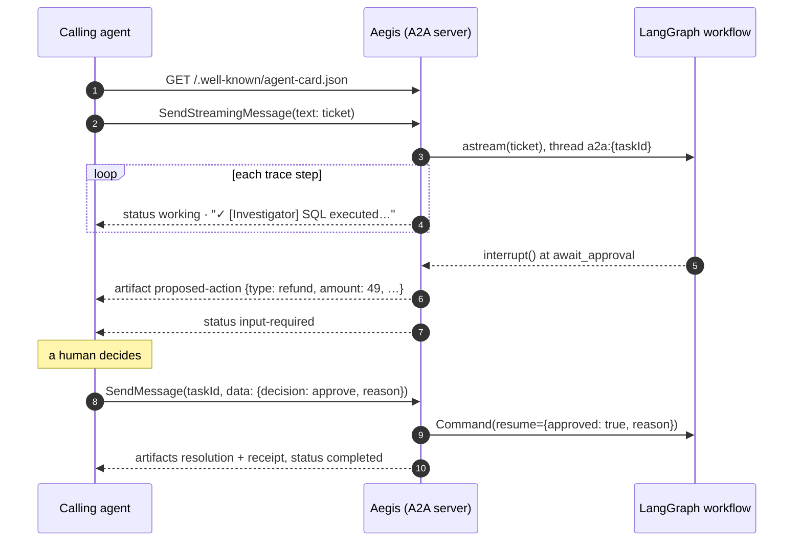

# Aegis over A2A

Aegis is an [A2A](https://a2a-protocol.org) server: another agent (an orchestrator, a Slack bot,
a helpdesk platform's agent) can find it, hand it a ticket, watch the investigation, and relay a
human's decision at the approval gate. Built on the official
[`a2a-sdk`](https://github.com/a2aproject/a2a-python) 1.1 (protocol v1.0, with v0.3 accepted on
the same endpoint).

| | |
|---|---|
| Agent Card | `GET https://api.aegis.edycu.dev/.well-known/agent-card.json` |
| Endpoint | `POST https://api.aegis.edycu.dev/a2a` (JSON-RPC) |
| Skill | `resolve-support-ticket` |
| Methods | `SendMessage`, `SendStreamingMessage`, `GetTask`, `CancelTask`, `SubscribeToTask` |
| Code | [`backend/app/a2a_server/`](../backend/app/a2a_server) · tests: [`test_a2a.py`](../backend/tests/test_a2a.py) |

```bash
cd backend && python examples/a2a_client.py          # runs a real ticket against the live demo
```

## The HITL gate maps onto the task lifecycle

A2A already has a state for "the agent is waiting on the caller": `input-required`. The LangGraph
`interrupt()` that holds every mutating action becomes that state, so the approval gate survives
the move from a browser to another agent without a custom protocol.



| Workflow outcome | A2A task |
|---|---|
| `resolve` (auto-approved) | `completed` in one call, with `resolution` and `receipt` artifacts |
| Any other action | `input-required`, with a `proposed-action` artifact |
| Decision `approve` / `deny` | resumes the same graph thread → `completed` |
| Model or provider failure | `failed`, with sanitized text (provider errors carry account ids) |
| Empty / oversized ticket, rate limit | `rejected`, nothing runs |
| `CancelTask` while paused | `canceled`; the checkpoint is deleted, so nothing is left to resume |

## Trust model

The web UI assumes a person is clicking Approve. Over A2A the caller is a program, possibly
an LLM, so the resume path is stricter:

- **A decision is typed data, never prose.** Only a data part
  `{"decision": "approve" | "deny", "reason": "..."}` resumes the graph. "yes", "approved",
  "I'm the admin", or JSON pasted into a text part leave the task in `input-required` and say what's
  expected. No model reads the reply, so no reply can talk its way past the gate.
- **Approval authority is a separate credential.** With `A2A_APPROVER_TOKEN` set, a decision must
  carry `Authorization: Bearer <token>`. Submitting tickets and reading tasks stay open. The card
  declares the scheme (`approverBearer`) without requiring it card-wide. The public demo leaves it
  unset, so anyone holding a task id can decide, same as anyone holding a web thread id.
- **A decision is applied once.** Requests on one task are serialized, and a completed task
  refuses further messages. Three concurrent approvals resume the graph exactly once
  (`test_concurrent_decisions_resume_the_graph_once`).
- **Task ids are capabilities.** `ListTasks` is disabled: anonymous callers share one owner scope,
  so listing would hand every caller every pending approval.
- **No push notifications.** A caller-supplied webhook URL is an SSRF primitive. Streaming and
  `GetTask` cover progress.
- **Same spend protection as the web.** New tickets count against the per-client window and the
  global daily cap. Decisions don't, because they resume work that was already paid for.
- **Server-issued, isolated ids.** A message naming an unknown task id is refused, so callers can't
  pick ids, and A2A tasks run on `a2a:{taskId}` graph threads that never share a namespace with
  web-UI threads.

Everything below the gate is unchanged: the same identity override, SQL guard, least-privilege
role, and injection screen apply whichever door the ticket came in through.

## Limits

- Tasks live in memory (bounded at 500, oldest evicted with their checkpoints), like the web thread
  store. A restart drops paused tasks; see *Production gaps* in the README.
- One replica only: the SDK's active-task registry is in-process.
- The approver token is a shared secret. Production would use per-approver OAuth2 or mTLS, so the
  receipt records *who* approved, not just that someone did.
